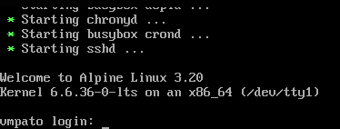

# Vmitmy

- [1. Descripción](1.-descripción)
- [2. Instalación y despliegue](2.-instalación-y-despliegue)
- [2.1. Despliegue automático](2.1.-despliegue-automático)
- [2.2. Despliegue manual](2.2.-despliegue-manual)
- [2.3. Aclaraciones](2.3.-aclaraciones)

## 1. Descripción

El presente laboratorio está diseñado para practicar ataques de Man-in-the-Middle (MitM). El laboratorio cuenta con dos contenedores que actuarán como cliente y servidor.

## 2. Instalación y despliegue

### 2.1. Despliegue automático

Para desplegar el laboratorio, basta con descargar la máquina desde este [enlace](https://www.mediafire.com/file/gch991bq9b2ggdi/Vmitmy.zip/file). Una vez descargada, debemos descomprimirla y hacer doble clic para importarla a VirtualBox (por el momento, la única plataforma soportada). Una vez importada, basta con iniciar la máquina y, cuando aparezca el mensaje de login, podremos comenzar a trabajar.



### 2.2. Despliegue manual

Para desplegar el laboratorio manualmente, debemos configurar una máquina, por ejemplo, con Alpine Linux. Para dejar operativa la máquina, podemos guiarnos del script `/home/yuno/repos/web-hackrooms/1-Vmitmy/conf-manual.sh` para instalar Docker, configurar la red macvlan, interfaz y subinterfaz, y lanzar los contenedores necesarios.

### 2.3. Aclaraciones

Los contenedores y la subinterfaz trabajan con la subred 192.168.0.0/24. Los contenedores se lanzan con las IPs 192.168.0.90 y 192.168.0.91. Si esta no es la subred en la que se está trabajando, se debe ingresar al servidor y cambiar estos valores en el script `/usr/local/bin/docker.sh`. El usuario es `root` y la contraseña es `pato`.

## 3. Objetivos del laboratorio

**Description**
Después de salir del nivel 15, escuchas a Jerry mencionar que, para salir del nivel 110, debes encontrar y unir una llave que está rota. Escuchas al sabueso en 192.168.0.90 y en 192.168.0.91 discutir sobre el paradero de la entrada. Ahora sigues tu camino.

**Targets**
Ingresa al nivel 110 y "repara" la llave.

**Steps**
1. Intercepta la comunicación entre los sabuesos.
2. Ingresa al nivel 110 y busca la llave.
3. Descifra la flag.

**Tool**
- Ettercap/Bettercap

Las pistas de la llave y la forma de su desencriptación se encuentran dentro del servidor. Sugiero revisar los historiales.

**Run**
1. Descargar la máquina desde el [enlace](https://www.mediafire.com/file/gch991bq9b2ggdi/Vmitmy.zip/file).
2. Descomprimir el archivo y al dar doble clic se importará la máquina a VirtualBox.
3. Para saber si el laboratorio ya está operativo, puedes acceder a la IP 192.168.0.90 desde el navegador (desde que se lanza la máquina habrá que esperar unos dos minutos para que todas las configuraciones carguen).
4. Dependiendo de la conexión a Internet, deberás verificar la configuración de red de la máquina: Dual-band para WiFi y PCIe para conexiones por cable.


5. Una vez cargue la siguiente pantalla, la máquina estará encendida y podrás comenzar a trabajar en el laboratorio. Ten en cuenta que no accederás al servidor por esta interfaz; esta pantalla solo indica que el laboratorio está operativo.


## 4. Resolución de la máquina

### 4.1. Intercepción de sabuesos

Para comenzar, debemos hacer un ARP poison para que nuestro host intercepte todas las peticiones. Para ello, podemos utilizar ettercap de la siguiente manera:

```bash
sudo ettercap -T -M arp:remote /192.168.0.90// /192.168.0.91//
```

> **Nota**: Verifica que el host permita el envío y redirección de paquetes en `/proc/sys/net/ipv4/ip_forward`.

Una vez hayamos interceptado la comunicación, veremos las diferentes solicitudes que el cliente le hace al servidor. Cuando hayamos capturado suficientes, notaremos que en una de las solicitudes aparecerá un usuario para una conexión SSH.

### 4.2. Cracking de credenciales

Para obtener la contraseña SSH, primero debemos ubicar la IP que tiene este servicio corriendo dentro de nuestra red:

```bash
nmap -Pn -p22 -sV 192.168.0.0/24 --open
```

Cuando hayamos encontrado la IP que contiene el servicio SSH, debemos crackear la contraseña con herramientas como Hydra:

```bash
hydra -l miau -P SecLists/Passwords/500-worst-passwords.txt [IP] ssh
```

No olvides reemplazar `[IP]` por la IP del host que tiene el servicio SSH.

### 4.3. Recuperación de la flag

Cuando nos conectemos por SSH, encontraremos una carpeta en el directorio del usuario. Dentro, encontraremos diversos archivos con diferentes nombres. En los nombres de estos archivos está la flag y deberemos extraer ciertos caracteres para concatenarlos.
Primero, verificamos el historial de comandos y ejecutamos el comando que no viene en el paquete Unix: `cave`. Este nos mostrará una serie de rutas en las que deberemos navegar para encontrar las pistas.
Por último, podremos crear un script que ordene los nombres de los archivos según los últimos dos números de cada nombre y concatene el primer carácter para obtener la flag.
