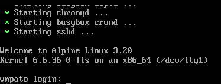
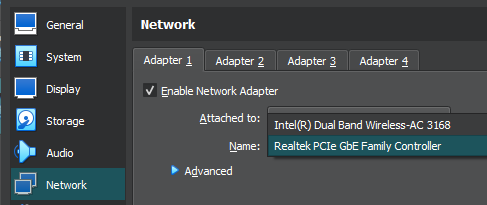

# Minite

- [1. Descripción](#1-descripción)
- [2. Instalación y despliegue](#2-instalación-y-despliegue)
- [2.1. Despliegue automático](#21-despliegue-automático)
- [2.2. Despliegue semiautomático](#22-despliegue-semiautomático)
- [2.3. Despliegue manual](#23-despliegue-manual)
- [3. Descripción del laboratorio](#3-descripción-del-laboratorio)
- [4. Resolución de la máquina](#4-resolución-de-la-máquina)
- [4.1. Descripción general](#41-descripción-general)

## 1. Descripción

Esta imagen facilita un laboratorio centrado en inspecciones de contenido de una SPA. Los usuarios podrán practicar habilidades de captura de solicitudes e inspecciones de contenido JS. Este laboratorio utiliza una imagen basada en Nginx:Alpine y la SPA está construida con Angular 18.1.0.

## 2. Instalación y despliegue

### 2.1. Despliegue automático

Para desplegar el laboratorio, basta con descargar la máquina desde este [enlace](https://www.mediafire.com/file/ufjcpt8z9wlafwg/Minitee.zip/file). Una vez descargada, debemos descomprimirla y hacer doble clic para importarla a VirtualBox (por el momento, la única plataforma soportada). Una vez importada, basta con iniciar la máquina y, cuando aparezca el mensaje de login, podremos comenzar a trabajar.



### 2.2. Despliegue semiautomático

Para desplegarla manualmente bastará con ejecutar el siguiente comando:

```bash
docker network create minite
docker run -d --name app -p 80:80 --network minite kradbyte/minite:app
docker run -d --name api -p 8080:8080 --network minite -e ASPNETCORE_ENVIRONMENT=Production kradbyte/minite:api
```

> **Nota**: La diferencia entre utilizar la máquina virtual y el contenedor es únicamente la IP que utilizaremos para acceder al laboratorio.

### 2.3. Despliegue manual

Para desplegar manualmente el laboratorio bastará con construir la imagen y lanzar el contenedor, ya sea en una máquina virtual o mapeando los puertos para que sea accedible por `localhost`. Puedes cambiar el funcionamiento de la SPA en la carpeta [app](app), posteriormente deberás compilar la aplicación y construir la imagen desde esta carpeta, utilizando el [Dockerfile](Dockerfile).
Dentro de la carpeta [app](app) se encuentra un Dockerfile que puede ser utilizado para probar la aplicación, en caso no tengas o quieras instalar Node en tu ordenador, para ello deberemos ingresar a la carpeta y seguir estos pasos:

- Construir la imagen con Node para la compilación.

```bash
docker build -t app .
```

- Lanzamos el contenedor para compilar o modificar la SPA.

```bash
docker run -d --name app -p 4200:4200 -v $(pwd):/app -w /app app
```

- Si modificamos la SPA y queremos revisar nuestros cambios, será necesario ejecutar el siguiente comando para precompilar el código.

```bash
docker exec -it app bash
ng serve --host 0.0.0.0 --disable-host-check
```

Luego podremos ingresar al navegador para verificar nuestros cambios, en `http://localhost:4200`.

- Una vez hayamos verificado nuestros cambios y que estos sean funcionales, deberemos compilar el código:

```bash
docker exec -it app bash
ng build --configuration production
```

- Para limpiar nuestro sistema podremos limpiar caché y las construccioes que Docker almacena, y por último podremos constuir nuestra imagen con el (Dockerfile)[Dockerfile] principal.

```bash
docker system prune -fa
#cd 3-Minite
docker build -t server .
```

En caso de querer modificar la API, también hay un [dockerfile](minimalapi/Dockerfile) que servirá para compilar nuestra API. A diferencia del Dockerfile anterior, con la API solo podremos generar una imagen compilada, para pruebas deberemos instalar Visual Studio o eliminar y reconstruir la imagen por cada cambio que hagamos.

```bash
#cd minimalapi
docker build -t api .
```

Por último lanzamos los contenedores con nuestras imágenes creadas.

```bash
docker network create minite
docker run -d --name app -p 80:80 --network minite server
docker run -d --name api -p 8080:8080 --network minite -e ASPNETCORE_ENVIRONMENT=Production api
```

## 3. Descripción del laboratorio

**Description**
Luego de salir de las cuevas del nivel 6, llegas al nivel 7. Para salir de este nivel deberás mojarte un poco.

**Targets**
Recupera la flag

**Steps**
- Busca pistas.
- Utiliza las rutas
- Recupera la flag

**Tools**
BurpSuite, Navegador

**Run**
1. Descargar la máquina desde el [enlace](https://www.mediafire.com/file/ufjcpt8z9wlafwg/Minitee.zip/file).
2. Descomprimir el archivo y al dar doble clic se importará la máquina a VirtualBox.
3. Para saber si el laboratorio ya está operativo, puedes acceder a la IP de la máquina que se lanzó o ingresando al localhost, según el camino que se escogió, desde el navegador (desde que se lanza la máquina habrá que esperar unos dos minutos para que todas las configuraciones carguen).
4. Dependiendo de la conexión a Internet, deberás verificar la configuración de red de la máquina: Dual-band para WiFi y PCIe para conexiones por cable.



5. Una vez cargue la siguiente pantalla, la máquina estará encendida y podrás comenzar a trabajar en el laboratorio. Ten en cuenta que no accederás al servidor por esta interfaz; esta pantalla solo indica que el laboratorio está operativo.


## 4. Resolución de la máquina

### 4.1. Descripción general

Podremos inspeccionar el archivo `main.js` para verificar las rutas o podremos explorar la SPA manualmente para ver el funcionamiento general del sitio. Al explorar las rutas y funcionalidades de la forma llegaremos a una parte donde solo se acepta cierta IP para acceder al sitio, si capturamos esta solicitud con BurpSuite para ver las redirecciones notaremos que la validación se pasa por un parámetro, por lo que podremos manipular esta información con BurpSuite o ingresando directamente al navegador. En la nueva página tendremos información adicional que nos servirá más tarde y si seguimos navegando por el sitio notaremos otra redirección que podremos capturar con BurpSuite. Esta última redirección nos proporcionará otra ruta con parámetros, pero al ingresar los parámetros habrá un error en consola. Si verificamos el error notaremos una conexión a una API. Independientemente de cómo hayamos levantado el laboratorio, en el puerto 8080 estará alojodo el servicio de la api, por lo que podremos realizar las consultas directamente a la API, para que no nos muestre el error en la consola del navegador. Por último, el endpoint requiere de tres parámetros, cuyos valores respectivos hacen referencia a los laboratorios pasados en este mismo repositorio. De no encontrar las soluciones revisar el endpoint en [Program.cs](minimalapi/Program.cs).
También podremos inspeccionar el archivo `main.js` para encontrar las solicitudes a la API y con un poco de intuición llegaremos al mismo endpoint que solicita la flag.
