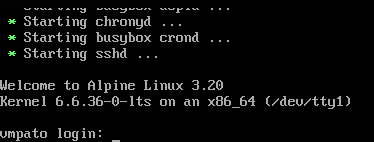
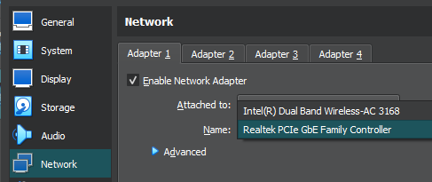

# Roboken

- [1. Descripción](#1-descripción)
- [2. Instalación y despliegue](#2-instalación-y-despliegue)
- [2.1. Despliegue automático](#21-despliegue-automático)
- [2.2. Despliegue manual](#22-despliegue-manual)
- [2.2.1. Modificaciones a la SPA](221-modificaciones-a-la-spa)
- [2.2.2. Modificaciones a la API](#222-modificaciones-a-la-api)
- [2.2.3. Modificaciones a la BD](#223-modificaciones-a-la-bd)
- [3. Descripción del laboratorio](#3-descripción-del-laboratorio)
- [4. Resolución de la máquina](#4-resolución-de-la-máquina)
- [4.1. Descripción general](#41-descripción-general)

## 1. Descripción

Este laboratorio está centrado en explotar vulnerabilidades mencionadas en el [Owasp Top 10](https://owasp.org/www-project-top-ten). Los usuarios podrán practicar habilidades de captura de solicitudes, inspecciones de contenido JS, XSS e inyecciones SQL. Este laboratorio utiliza cuatro imágenes: el servidor está basada en Nginx:Alpine, que contiene la SPA está construida con Angular 18.0.3, la Api está construida con .Net Core 8 y los otros dos contenedores, que actúan de usuarios, utilizan `selenium` para interactuar con la página.

## 2. Instalación y despliegue

### 2.1. Despliegue automático

Para desplegar el laboratorio, basta con descargar la máquina desde [este enlace](https://www.mediafire.com/file/k70ihi3gd75bu96/Roboken.zip/file). Una vez descargada, debemos descomprimirla y hacer doble clic para importarla a VirtualBox (por el momento, la única plataforma soportada, se desconoce si funciona con otras aplicaciones de virtualización). Una vez importada, basta con iniciar la máquina y, cuando aparezca el mensaje de login, podremos comenzar a trabajar. Tomar en cuenta que que el servidor y el cliente toman las ips: ***.***.***.56 y ***.***.***.57, si por alguna razón estas IPs no están disponibles, se deberán cambiar manualmente ingresando a la máquina virtual, modificando el script `/usr/local/bin/docker.sh`. El usuario de la VM es `root` y la contraseña es `Patit0!`.



### 2.2. Despliegue manual

Para desplegar manualmente el laboratorio bastará con ejecutar el siguiente comando dentro de esta carpeta:

```bash
docker-compose up -d
```

> **Nota**: Se utilizan IPs específicas para el cliente y el servidor, el gateway y la subnet. Verificar en el archivo [.env](.env) el valor correspondiente para cada caso, según sea tu subnet, gateway e ips disponibles.

Si prefieres configurar una máquina virtual que funcione de servidor con los contenedores dentro, podrás seguir los sencillos pasos descritos en el archivo [manual.md](manual.md).

#### 2.2.1. Modificaciones a la SPA

Puedes cambiar el funcionamiento de la SPA en la carpeta [app](app), posteriormente deberás compilar la aplicación y construir la imagen, utilizando el [dockerfile](app/Dockerfile).
Dentro de la carpeta [app](app) se encuentra un Dockerfile que puede ser utilizado para probar la aplicación, en caso no tengas o quieras instalar Node en tu ordenador, para ello deberemos ingresar a la carpeta y seguir estos pasos:

- Construir la imagen con Node para la compilación.

```bash
docker build -t app -f Dockerfile.dev .
```

- Lanzamos el contenedor para compilar o modificar la SPA.

```bash
docker run -d --name app -p 4200:4200 -v $(pwd):/app -w /app app
```

- Si modificamos la SPA y queremos revisar nuestros cambios, será necesario ejecutar el siguiente comando para precompilar el código.

```bash
docker exec -it app bash
ng serve --host 0.0.0.0 --disable-host-check
```

Luego podremos ingresar al navegador para verificar nuestros cambios, en `http://localhost:4200`.

- Una vez hayamos verificado nuestros cambios y que estos sean funcionales, deberemos compilar el código:

```bash
docker exec -it app bash
ng build --configuration production
```

- Para limpiar nuestro sistema podremos limpiar caché y las construccioes que Docker almacena, y por último podremos constuir nuestra imagen con el (Dockerfile)[Dockerfile] principal.

```bash
docker system prune -fa
#cd app
docker build -t server .
```
#### 2.2.2. Modificaciones a la API

En caso de modificar la API, también encontraremos un [dockerfile](apirest/Dockerfile) que servirá para compilar nuestra API. A diferencia del Dockerfile anterior, con la API solo podremos generar una imagen compilada, para pruebas deberemos instalar Visual Studio o eliminar y reconstruir la imagen por cada cambio que hagamos.

```bash
#cd apirest
docker build -t api .
```

Para probar los endpoints podremos utilizar _swagger_, especificando en el contenedor que estamos en desarrollo:

```bash
docker run -d --name api -p 8080:8080 -e ASPNETCORE_ENVIRONMENT=Development api
# http://localhost:8080/swagger
```

#### 2.2.3. Modificaciones a la BD

En caso de querer modificar la base de datos, deberemos dirigirnos a la carpeta [data](apirest/data) y lanzar alguna herramienta para SQLite o trabajar directamente con un contenedor:

```bash
# cd apirest/data
docker run -it --rm --name sqlite -v $(pwd):/data -w /data nouchka/sqlite3 Rest.db
```

> La base de datos se copia dentro del contenedor al momento de la construcción de la API, por lo que no es persistente, a menos que se le monte un volumen.

## 3. Descripción del laboratorio

**Description**
Para los hackers es habitual hablar de los payloads y los exploits. En resumidas cuentas el exploit es la forma en que se explota una vulnerabilidad, y el payload es lo que se busca hacer al explotar la vulnerabilidad. Suponiendo que quieras ingresar a una casa sin llave, el exploit serían los métodos o formas de ingresar, como utilizando una ventana, una puerta trasera, etc; el payload sería lo que se haría al lograr ingresar a la casa, como llevarse algún objeto, dejar una nota, etc. En un caso más práctico, un script funcionaría como exploit y lo que hace el código sería el exploit.
Oh sí, para este lab vamos a ver payloads (OWASP), escalaciones y exploits personalizados.

**Target**
Recupera la flag

**Steps**
- Auditoría general de funcionamiento
- Búsqueda de rutas, endpoints y vulnerabilidades.
- Exploits en payloads encontrados.
- Recuperación de flag

**Grants**
- Las pistas las encontraremos dentro del lab.
- [cirt-default-usernames.txt](https://github.com/danielmiessler/SecLists/blob/master/Usernames/cirt-default-usernames.txt), [500-worst-passwords](https://github.com/danielmiessler/SecLists/blob/master/Passwords/Common-Credentials/500-worst-passwords.txt).txt.
- Pay attention.

**Tools**
Burp Suite

**Run**
- Descarga la máquina [desde aquí](https://www.mediafire.com/file/k70ihi3gd75bu96/Roboken.zip/file).
- Descomprime e impórtala a Virtualbox.
- Espera unos minutitos para que se termine de instalar lo necesario. Sabrás que la máquina está lista cuando ya puedas ingresar a la página de login en el navegador.
- Para validar que el laboratorio esté operativo, bastará con ingresar la IP de la máquina en cualquier navegador, hacer un ping o un curl.
- _Nota_: Al iniciar la máquina habrá un mensaje de inicio de sesión, esto nos indica que la máquina ha terminado de encender y podremos comenzar a trabajar. Deberemos tener cuidado nuevamente con los adaptadores de red según estemos conectados por WiFi (Dual-Band) o por cable (PCIe).



## 4. Resolución de la máquina

### 4.1. Descripción general

Primero deberemos encontrar la IP del servidor, podremos utilizar nmap para encontrar el servicio:

```bash
nmap -Pn -p 80 --open $(nmap -sn 192.168.0.0/24 | grep report | cut -d ' ' -f 5)
```

Cuando hayamos ingresado a la página, encontraremos un login que podremos vulnerar con la pista en el HTML. Dentro del sistema deberemos ver el flujo de las tareas y encontrar la ruta donde se obtiene la flag. Notaremos que cada cambio de estado se hará según roles, al igual que la obtención de la flag. Para escalar privilegios deberemos obtener las cookies de los demás usarios: la primera cookie la obtendremos con un MitM, la IP víctima la encontraremos interactuando con las tareas; para obtener la otra cookie deberemos hacer un exploit, con el payload XSS. Si al cambiar los valores de las cookies nos da un error obteniendo las flags, es porque estaremos consultando un endpoint al que no tendremos acceso, asegúrate de cambiar el rol adicional a la cookie de sesión (puedes obtener los roles con SQL Injection en algún componente). Los parámetros que debes pasar cuando consultas las flags, están en los textos (poemas) de los labs anteriores de este repositorio.
